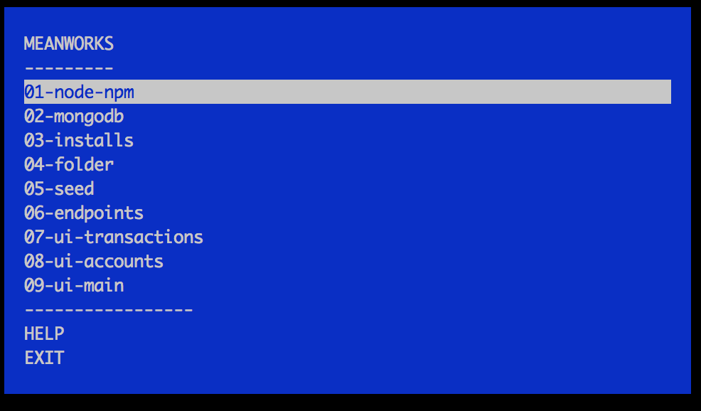

MEANWorks: MongoDB/Mongoose, Express, Angular and Node Workshop with Angular Fullstack Generator

=========


---

M.E.A.N. Works is a workshop on

* MongoDB+Mongoose
* Express.js
* AngularJS
* Node.js

with Angular Fullstack Generator.
---

## Installation

Easy way:

```
$ npm install meanworks@latest
```

Hard way:

```
$ git clone https://github.com/azat-co/meanworks.git
$ cd meanworks
$ npm install
$ npm link
```

If `$ npm link` fails, try `$ node meanworks.js` or `$ npm start`.

---

## Usage

* `$ meanworks` or `node meanworks.js`: launch menu to select the adventure and monitor progress
* `$ meanworks verify`: verify solution
* `$ meanworks verify YOUR_FILE_NAME`: to verify that you have finished an exercise with a filename
* `$ meanworks help`: to get help with the workshop
* `$ meanworks print`: to re-display the current exercise
* `$ meanworks solution`: to show the solution for the current exercise
* `$ meanworks verify skip` to skip it.
* `$ meanworks reset` to reset the completed adventures

---

## Adventures

1. 01-node-npm
1. 02-mongodb
1. 03-installs
1. 04-folder
1. 05-seed
1. 06-endpoints
1. 07-ui-transactions
1. 08-ui-accounts
1. 09-ui-mai


---

## Reset

If you have completed all or some of the adventures but want to do them again, simply run meanworks reset.



---

## Feedback

Bugs?

:bug::bug::bug: >>> https://github.com/azat-co/meanworks/issues

---

## Contributing

1. Fork this repository
1. Make changes in a branch off from master
1. Submit a pull request to azat-co/meanworks (this tool)
